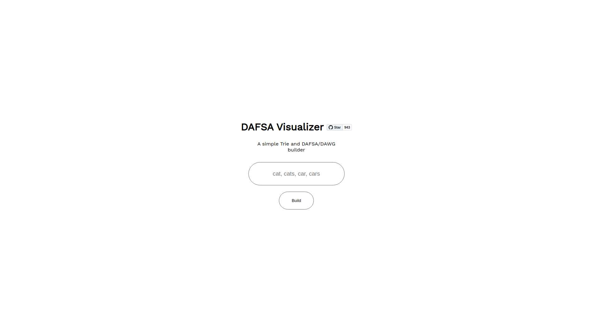
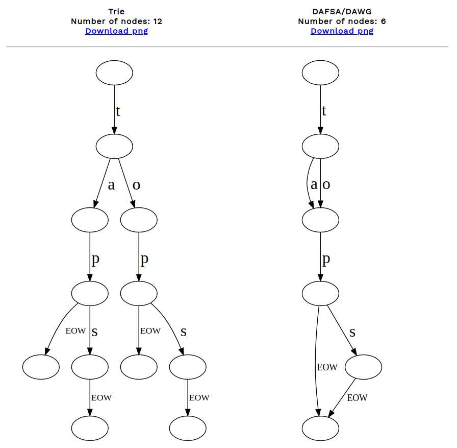

# Trie & DAWG visualizer
A simple  trie and dawg visualizer using [GraphViz](http://www.graphviz.org/) in TS

Webpage: [keivan-sf.github.io/dafsa-visualizer](https://keivan-sf.github.io/dafsa-visualizer/)

### Motivation
I don't have experience in theories of computation so one should not look at this project as the right way of implementing these data structures. The main goal is to help visual learners like me understand the concepts of them.
### How it works
The program first builds a [Trie](https://en.wikipedia.org/wiki/Trie) and them performs a [DFA minimization](https://en.wikipedia.org/wiki/DFA_minimization) to convert it into a [DAWG](https://en.wikipedia.org/wiki/Deterministic_acyclic_finite_state_automaton).

As far as I know, there are 2 ways of creating a DAFSA/DAWG:

- Creating a trie then minimizing it
- Creating a dawg in one step

### Examples

### Resources

Article and projects which I find useful in this concept:

##### [Wiki pedia - DAFSA](https://en.wikipedia.org/wiki/Deterministic_acyclic_finite_state_automaton)
##### [JB's Blog - DAWG](https://jbp.dev/blog/dawg-basics.html)
##### [Incremental Construction of Minimal Acyclic Finite State Automata and Transducers](https://aclanthology.org/W98-1305/)
- This article shows a way of creating a dawg in one step
##### [Github.com/vtortola/dawg](https://github.com/vtortola/dawg)
- This repo implements a dawg building algorithm in c# and contains a visual explanation of it along side useful data and statistics
##### [DFA-minimization algorithm](https://www.youtube.com/watch?v=7W2lSrt8r-0)
- This video explains a DFA-minimization algorithm along side other useful concepts. Which can be used in minimizing a trie into a dawg
